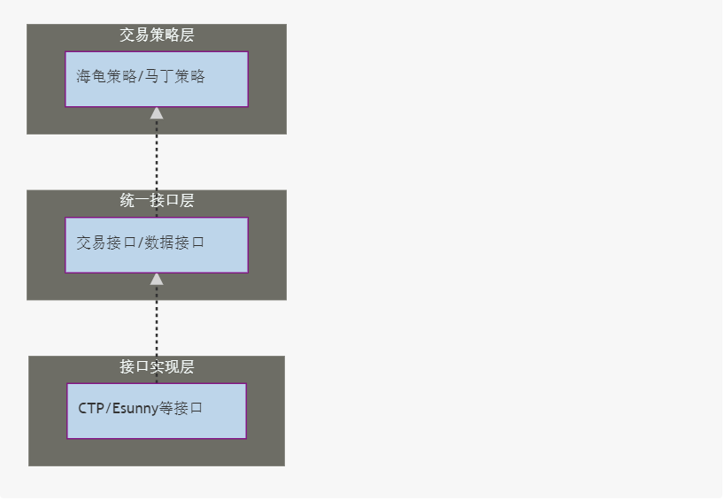
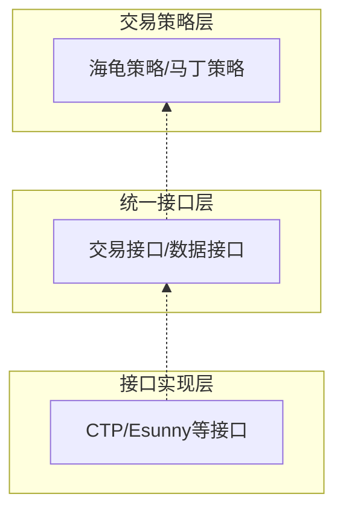
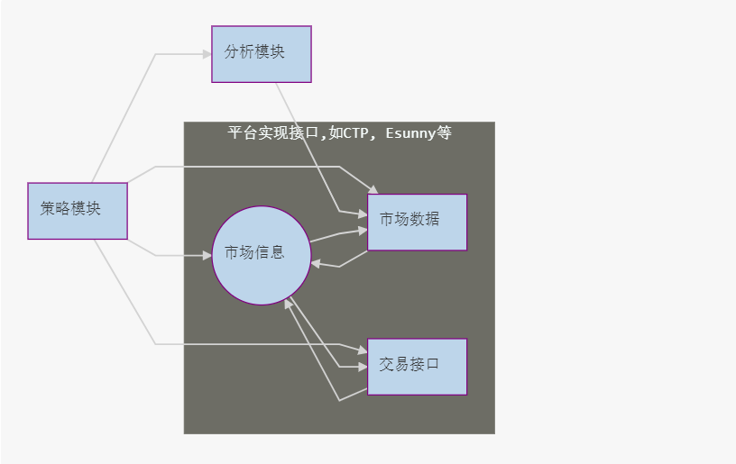
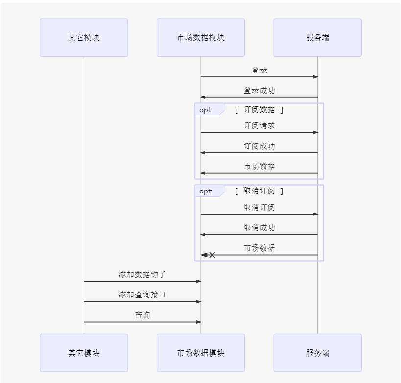
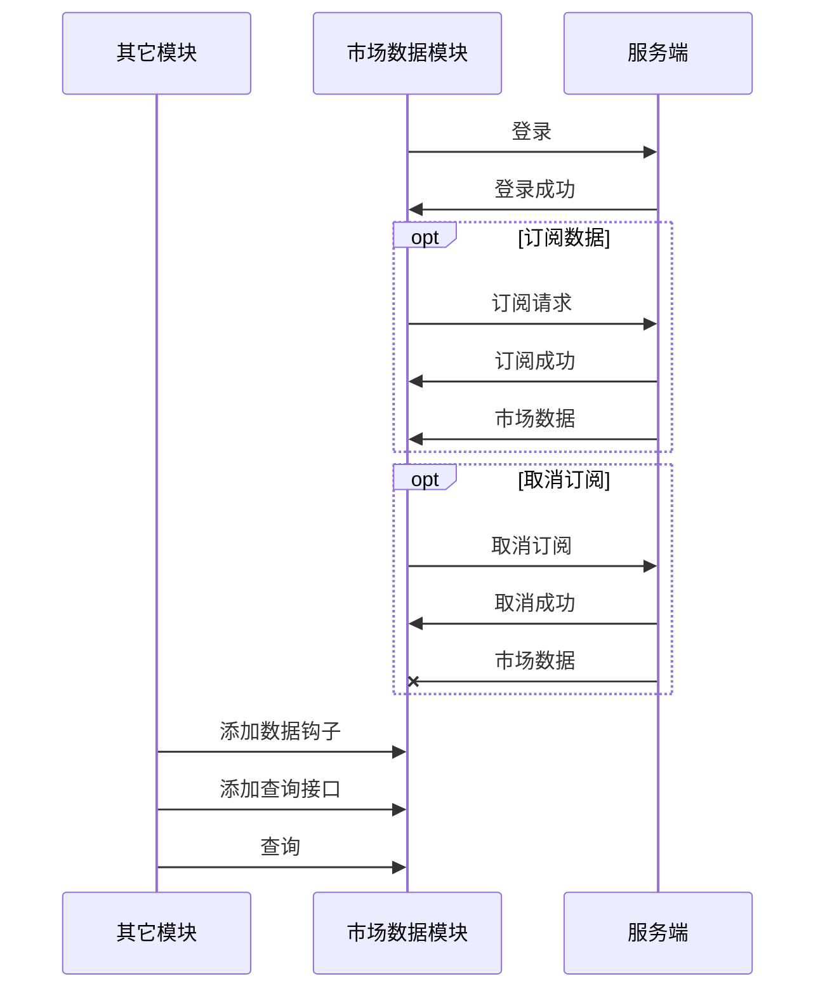
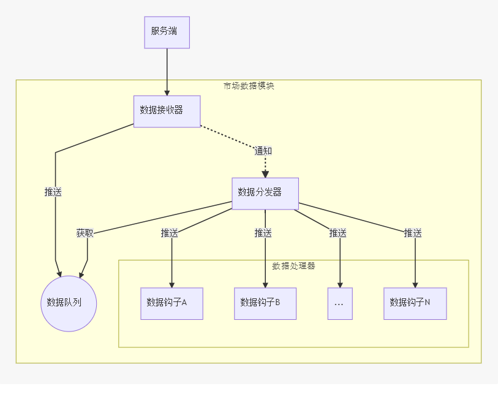
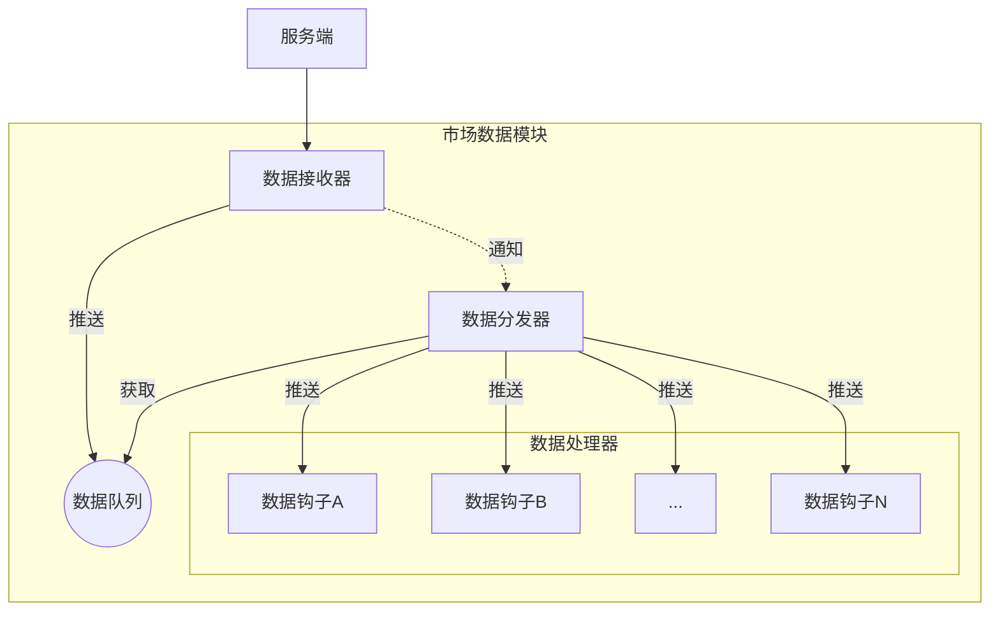
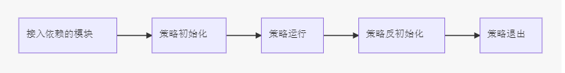

One Trader
========
一个简单的策略交易框架
--------
<!-- TOC -->

- [1. 架构](#1-架构)
    - [1.1. 层次划分:](#11-层次划分)
    - [1.2. 模块划分：](#12-模块划分)
        - [1.2.1. 市场数据](#121-市场数据)
            - [1.2.1.1. Tick与K线数据定义：](#1211-tick与k线数据定义)
            - [1.2.1.2. 接口设计概述](#1212-接口设计概述)
        - [1.2.2. 市场信息](#122-市场信息)
        - [1.2.3. 交易接口](#123-交易接口)
        - [1.2.4. 分析模块](#124-分析模块)
            - [1.2.4.1. 分析模块概述](#1241-分析模块概述)
            - [1.2.4.2. 分析模块接口](#1242-分析模块接口)
        - [1.2.5. 策略模块](#125-策略模块)
        - [1.2.6. FAQ](#126-faq)
- [2. 框架开发](#2-框架开发)
    - [2.1. 代码风格](#21-代码风格)
    - [2.2. 接口原则](#22-接口原则)
    - [2.3. 平台接入](#23-平台接入)
- [3. 策略开发](#3-策略开发)
- [4. 配置](#4-配置)
- [5. TODO](#5-todo)

<!-- /TOC -->
# 1. 架构
## 1.1. 层次划分:



## 1.2. 模块划分：

```mermaid
graph LR 
市场信息((市场信息))
策略模块 --> 市场数据
策略模块 --> 市场信息
策略模块 --> 分析模块
策略模块 --> 交易接口
市场数据 --> 市场信息
交易接口 --> 市场信息
分析模块 --> 市场数据 
subgraph 平台实现接口,如CTP, Esunny等
    市场信息 --> 市场数据
    市场信息 --> 交易接口
end
```

|模块|说明|
|:--:|:--|
|[市场数据](#市场数据)|管理并获取序列化的实时和历史行情并更新市场信息|
|[市场信息](#市场信息)|存储市场交易品种的基本属性及最新询价(Tick)等|
|[交易接口](#交易接口)|执行交易,获取资金信息，仓位信息，订单信息|
|[分析模块](#分析模块)|方便对数据进行分析，如指标分析等,用于指导交易|
|[策略模块](#策略模块)|综合决策模块,调用其它模块完成自动化交易|
|||

所有的模块都是为策略模块服务，以策略模块为中心，其它模块扩展升级等应该保持对策略模块的绝对兼容与向后兼容
### 1.2.1. 市场数据
接口文件: `MarketData.h`
#### 1.2.1.1. Tick与K线数据定义：
```
/** @brief Tick结构定义 */
struct Tick
{
    uint64_t    time;           /*< 最近更新时间 */
    uint32_t    time_ms;        /*< 以毫秒为单位的最近更新时间 */
    double      bid;            /*< 当前买入价 */
    double      ask;            /*< 当前卖出价 */
    double      last;           /*< 最近交易价格 */
    uint32_t    bid_volume;     /*< 当前买价量 */
    uint32_t    ask_volume;     /*< 当前卖价量 */
    uint64_t    volume;         /*< 最近交易量 */
    double      openinterest;   /*< 持仓量 */
};

/** @brief 行情Bar定义 */
struct Bar
{
    uint64_t    time;           /*< 时间截 */
    double      open;           /*< 开盘价 */
    double      close;          /*< 收盘价 */
    double      high;           /*< 最高价 */
    double      low;            /*< 最低价 */
    uint64_t    volume;         /*< 成交量 */
    double      openinterest;   /*< 持仓量 */
};
```
Tick:

|时间戳|毫秒|买价|卖价|最近成交价|bid量|ask量|成交量|持仓量|
|:--:|:--:|:--:|:--:|:--:|:--:|:--:|:--:|:--:|
|time|time_ms|bid|ask|last|bid_volume|ask_volume|volume|openinterest|
||||||||||

Bar:  

|时间戳|开盘价|收盘价|最高价|最低价|成交量|持仓量|
|:--:|:--|:--|:--|:--|:--|:--|
|time|open|close|high|low|volume|interest|
||||||||

Tick中需要ask与bid主要是考虑到回测需要(撮合成交一般取bid, ask, last的中间价格),目前只定义了一档价格。   
#### 1.2.1.2. 接口设计概述
市场数据模块主要提供以下只大功能:  

|功能|说明|
|:--:|:--|
|登录登出|远程市场数据服务器的登录与登出操作|
|参数设置|设置模块所需要的参数，如服务器地址|
|数据订阅|根据品种订阅市场数据服务器的数据|
|数据钩子|对于服务器推送的实时数据采用数据钩子的方式处理|
|数据获取|提供灵活的数据获取方式,如通过倒序索引,时间等|
|数据整合|对于数据源(如历史如数等)进行整合，可通过当前统一接口获取|
|模块状态|提供当前模块的工作状态信息|
|||







### 1.2.2. 市场信息
+ TODO
### 1.2.3. 交易接口
+ 管理订单 提交新订单，修改订单属性
+ 管理仓位 修改仓位属性
+ 管理资金账户 获取资金信息
### 1.2.4. 分析模块
#### 1.2.4.1. 分析模块概述
  * 指标分析(主要对价格等交易数据进行统计分析,如使用常规指标ATR,RSI等)
  * 数据分析(各种能指导交易的数据分析，如基本面数据,基差,等等)
#### 1.2.4.2. 分析模块接口
+ TODO
### 1.2.5. 策略模块
策略模块启动流程:



### 1.2.6. FAQ
1. 为什么不把资金信息,仓位信息，订单信息以模块方式单独出来，而是要放在交易接口中？</p>
因为设计是要支持多个交易接口多策略同时工作的,一个账户对应一个交易接口，  
同时可以存在多个交易模块,每个交易接口都有单独的资金信息，仓位信息以及订单信息  
单独出来的话还要区分不同的账户   

# 2. 框架开发
## 2.1. 代码风格
- 类, 类公有成员,全局变量,函数 使用匈牙利命名法
- 类私有与保护成员使用m_开头 并使用小写加下划线模式
- 函数局部变量使用小写加下划线方式
- 注释风格使用javadoc风格
## 2.2. 接口原则
避免因为增加接口而造成版本不兼容
- 接口的实现不使用变量，只使用函数
- 属性使用GetPropertyString, GetPropertyInteger, GetPropertyDouble的方式进行扩展
## 2.3. 平台接入
平台的接入要实现[市场数据](#市场数据),[交易接口](#交易接口),[市场信息](#市场信息)

# 3. 策略开发
+ TODO
# 4. 配置
+ 配置文件格式为json, 使用json schema 校验
简单示例:
```
{
    "Modules": [
        {
            "name": "itap",
            "enable": true,
            "path": "itap.dll"
        }
    ],
    "Framework": {
        "name":"OneTrader",
        "marketdata": {
            "name":"itap_marketdata",
            "module":"itap",
            "login":false,
            "params":{
                "server":"61.163.243.173",
                "port": 8383,
                "user": "no",
                "passwd": "onetrader"
            }
        },
        "marketinfo": {
            "name": "itap_marketinfo",
            "module": "itap"
        },
        "trader": {
            "name": "itap",
            "module": "itap",
            "auth": true,
            "login": true,
            "params": {
                "server":"61.163.243.173",
                "port": 8383,
            }
        }
    },
    "OneTrader":{
        "loglevel": 0
    }
}

```
# 5. TODO
- [ ] 完善此文档
